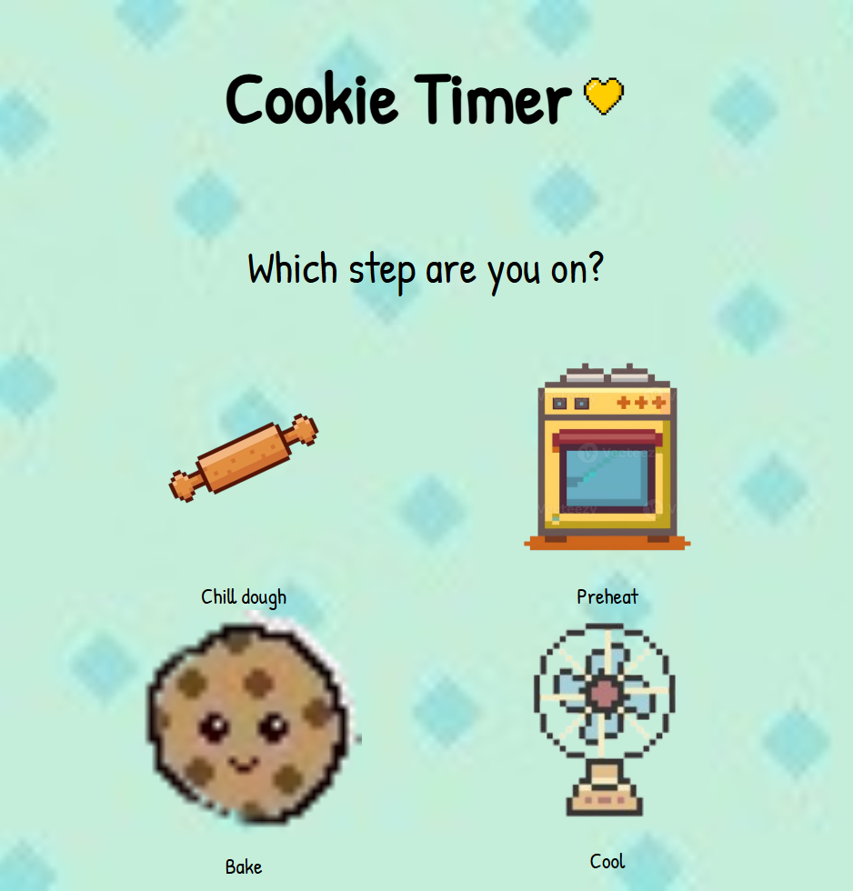
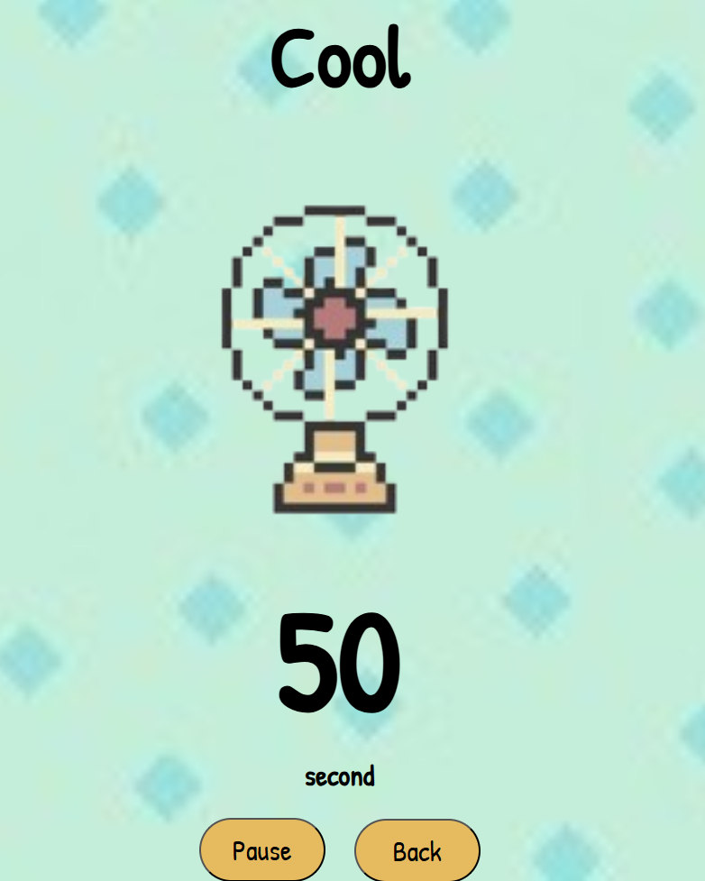
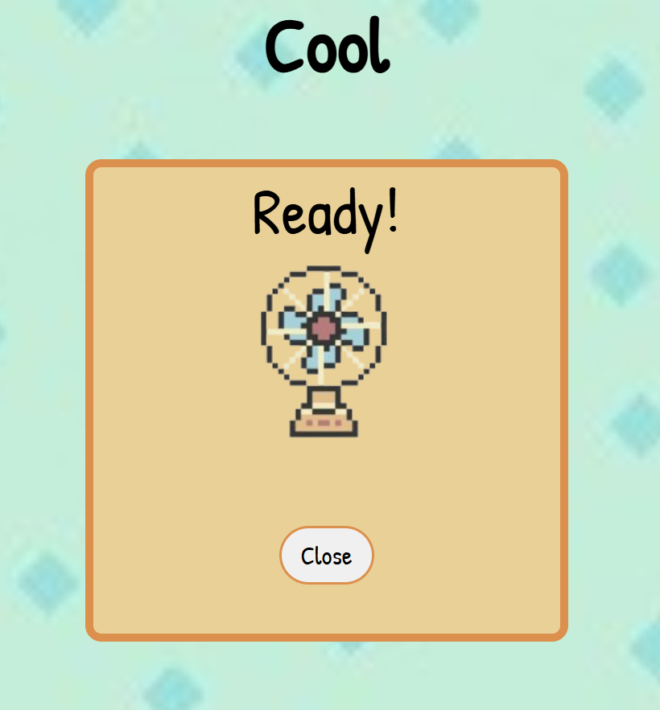

# 🍪 Cookie Timer

**Cookie Timer** is a fun, React-based step-by-step timer app designed to help you bake cookies perfectly. Baking cookies involves several crucial steps where timing is key — chilling the dough, preheating the oven, baking, and cooling all require precise timers to get the best results. Each stage of the baking process — **Chill Dough**, **Preheat**, **Bake**, and **Cool** — has its own dedicated timer with a clear visual and a helpful popup notification when the time runs out.


---

## 🚀 Features

- ⏱️ Step-by-step cookie baking timers
- 🖼️ Cute and themed images for each step
- 🔔 Popup alert when the timer reaches 0
- ⏯ Pause and resume functionality
- 🔁 Easy navigation between steps

---

## 🧱 Built With

- **React** 
- **React Router** — Routing between pages
- **CSS**
- **Electron** for desktop support

---

## ▶️ Run the App Locally

Make sure you have **Node.js** and **npm** installed.

### 1. Clone the repository

```bash
git clone https://github.com/your-username/cookie-timer.git
cd cookie-timer
```

### 2. Install dependencies
```bash
npm install
```

### 3. Start the development server
```bash
npm start
```

## ▶️ Run as desktop app

```bash
npm run electron
```

## Screenshots





